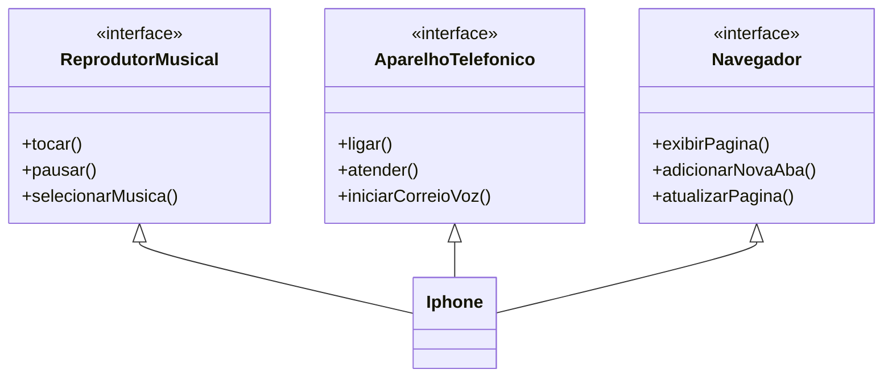

# DIO - Trilha POO Java
www.dio.me

## Autor do desafio e repositório com a proposta original
- [Gleyson Sampaio](https://github.com/glysns)
- [Desafio Diagramação de Classes do Iphone](https://github.com/digitalinnovationone/trilha-java-basico/tree/main/desafios/poo)

## Desafio de projeto
Para realizar o desafio, os pilares de Programação Orientada a Objetos e conhecimento sobre diagramação de classes com UML serão necessários.

## Contexto
O desafio é diagramar e modelar um Iphone em **UML** e **código** baseado-se no vídeo do [lançamento do primeiro Iphone](https://www.youtube.com/watch?v=9ou608QQRq8), onde Steve Jobs anuncia que o Iphone é a junção de um reprodutor musical, um aparelho telefônico e um dispositivo de comunicação com a internet (navegador).

Utilize conceitos de POO para diagramar com a ferramenta de sua preferência e criar as interfaces que representam as seguintes funções:

- **Reprodutor Musicial**: tocar, pausar, selecionarMusica

- **Aparelho Telefônico**: ligar, atender, iniciarCorrerioVoz

- **Navegador**: exibirPagina, adicionarNovaAba, atualizarPagina

Além de diagramar e criar a classe que representa o Iphone em si.

## Diagrama UML
Abaixo temos o diagrama UML que representa o Iphone herdando as características apresentadas:

